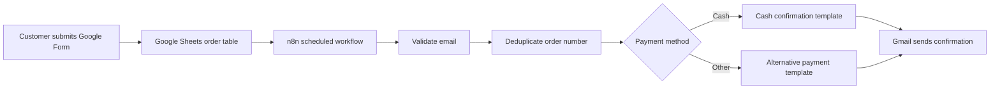

# El Pan de Lisa — Order Automation with n8n

A production self-hosted automation system for a small artisan bakery. It receives orders collected through Google Forms and Sheets, filters incomplete records, prevents duplicate processing, selects the correct payment instructions, and sends a branded confirmation through Gmail.

## What it accomplishes

- Checks the order spreadsheet automatically every hour.
- Ignores rows without a customer email address.
- Deduplicates orders using their order number.
- Routes cash and non-cash orders to different email templates.
- Sends personalized HTML confirmations through Gmail.
- Runs continuously on a DigitalOcean VPS rather than a time-limited SaaS trial.

## Architecture



The production deployment uses Docker Compose with three services:

- **n8n:** workflow orchestration.
- **PostgreSQL:** durable workflow and execution data.
- **Caddy:** HTTPS termination and automatic certificate renewal.

## Reliability and security

- HTTPS-only public access through Caddy.
- Firewall limited to SSH, HTTP, and HTTPS.
- Dedicated n8n encryption key for stored credentials.
- Secrets supplied through an untracked `.env` file.
- Persistent Docker volumes for n8n, PostgreSQL, and certificates.
- Automatic container restart policies.
- Daily database and application-data backups with 14-day retention.
- Google OAuth used for Gmail and Google Sheets; no Google passwords are stored.

## Repository contents

```text
.
├── README.md
└── vps
    ├── .env.example
    ├── Caddyfile
    ├── backup-n8n.sh
    └── compose.yaml
```

The live workflow export is intentionally excluded because it contains operational spreadsheet identifiers, customer-facing content, and business-specific configuration.

## Deploy

Prerequisites: an Ubuntu VPS, a DNS record pointing a subdomain to it, and Docker with the Compose plugin.

```bash
cd /opt/n8n
cp .env.example .env
openssl rand -hex 32
```

Generate two different random values, place them in `.env`, set `N8N_DOMAIN`, and start the services:

```bash
docker compose config
docker compose up -d
docker compose ps
```

Create the n8n owner account, configure Google OAuth credentials in the n8n interface, import a sanitized workflow, test it while inactive, and only then publish it.

## Backup operations

`vps/backup-n8n.sh` creates:

- A compressed PostgreSQL dump.
- A compressed archive of n8n application data.
- A protected copy of the deployment secrets required for disaster recovery.

Backups are stored on the VPS with restrictive permissions and rotated after 14 days. For a stronger disaster-recovery posture, the next improvement is encrypted off-site storage.

## Skills demonstrated

Workflow automation, Google OAuth, Gmail and Google Sheets integration, Docker Compose, PostgreSQL, Linux administration, DNS, TLS, firewall configuration, secret management, backup automation, and production migration.
