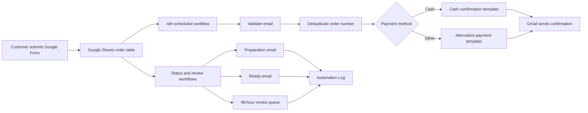

# El Pan de Lisa — Order Automation with n8n

A production self-hosted automation system for a small artisan bakery. It receives orders collected through Google Forms and Sheets, sends confirmations through Gmail, follows order-status changes, and requests customer reviews after delivery.

## What it accomplishes

- Checks the order spreadsheet automatically every hour.
- Ignores rows without a customer email address.
- Deduplicates orders using their order number.
- Routes cash and non-cash orders to different email templates.
- Sends personalized HTML confirmations through Gmail.
- Sends a branded update when an order enters `En preparación`.
- Sends a second update when an order becomes `Listo`.
- Queues delivered orders and requests a review after 48 hours.
- Prefills the review form with the order, customer, product, and email.
- Records every status notification in an `Automation Log` sheet.
- Runs continuously on a DigitalOcean VPS rather than a time-limited SaaS trial.

## Architecture



The production deployment uses Docker Compose with three services:

- **n8n:** workflow orchestration.
- **PostgreSQL:** durable workflow and execution data.
- **Caddy:** HTTPS termination and automatic certificate renewal.

## Reliability and security

- HTTPS-only public access through Caddy.
- Firewall limited to SSH, HTTP, and HTTPS.
- Dedicated n8n encryption key for stored credentials.
- Secrets supplied through an untracked `.env` file.
- Persistent Docker volumes for n8n, PostgreSQL, and certificates.
- Automatic container restart policies.
- Daily database and application-data backups with 14-day retention.
- Google OAuth used for Gmail and Google Sheets; no Google passwords are stored.

## Repository contents

```text
.
├── automation.env.example
├── dist
│   ├── el-pan-de-lisa-controlled-preparation-test.json
│   ├── el-pan-de-lisa-controlled-ready-test.json
│   ├── el-pan-de-lisa-controlled-review-test.json
│   └── el-pan-de-lisa-status-reviews.json
├── scripts
│   ├── build-controlled-preparation-test.mjs
│   ├── build-controlled-review-test.mjs
│   └── build-status-review-workflows.mjs
├── templates
│   ├── 1. Plantilla del correo En preparación….html
│   ├── 2. Plantilla del correo Listo….html
│   └── Plantilla del correo de solicitud de review….html
└── vps
    ├── .env.example
    ├── Caddyfile
    ├── backup-n8n.sh
    └── compose.yaml
```

The repository contains sanitized, inactive workflow exports. Operational spreadsheet IDs and credential references are injected through environment variables and no OAuth tokens, customer records, or VPS secrets are committed.

## Generate the workflow exports

Copy the example configuration and supply your own Google resource identifiers:

```bash
cp automation.env.example automation.env
set -a
source automation.env
set +a
node scripts/build-status-review-workflows.mjs
EPL_STATUS_TEST_OUTPUT_PATH="$PWD/dist/el-pan-de-lisa-controlled-preparation-test.json" \
  node scripts/build-controlled-preparation-test.mjs EXAMPLE-ORDER preparation
EPL_STATUS_TEST_OUTPUT_PATH="$PWD/dist/el-pan-de-lisa-controlled-ready-test.json" \
  node scripts/build-controlled-preparation-test.mjs EXAMPLE-ORDER ready
node scripts/build-controlled-review-test.mjs EXAMPLE-ORDER
```

The main generator creates four inactive production workflows:

1. Preparation notification.
2. Ready-for-pickup notification.
3. Review request queue after delivery.
4. Review email sender after the 48-hour waiting period.

Controlled tests remain inactive and filter a single order number, preventing accidental bulk sends during validation.

## Deploy

Prerequisites: an Ubuntu VPS, a DNS record pointing a subdomain to it, and Docker with the Compose plugin.

```bash
cd /opt/n8n
cp .env.example .env
openssl rand -hex 32
```

Generate two different random values, place them in `.env`, set `N8N_DOMAIN`, and start the services:

```bash
docker compose config
docker compose up -d
docker compose ps
```

Create the n8n owner account, configure Google OAuth credentials in the n8n interface, generate and import the sanitized workflows, test with the controlled workflows while everything is inactive, and only then publish the four production workflows.

## Reliability safeguards

- Bulk reads replace per-item spreadsheet lookups, avoiding ambiguous n8n item linking.
- Every candidate is deduplicated by `N.º de orden`, event type, and successful result.
- `NumeroOrden` is preserved internally and mapped explicitly to `N.º de orden` in the log.
- Gmail failures are logged as `Error` and remain eligible for retry.
- Successful sends are logged as `Enviado` and are not repeated.

## Backup operations

`vps/backup-n8n.sh` creates:

- A compressed PostgreSQL dump.
- A compressed archive of n8n application data.
- A protected copy of the deployment secrets required for disaster recovery.

Backups are stored on the VPS with restrictive permissions and rotated after 14 days. For a stronger disaster-recovery posture, the next improvement is encrypted off-site storage.

## Skills demonstrated

Workflow automation, Google OAuth, Gmail and Google Sheets integration, Docker Compose, PostgreSQL, Linux administration, DNS, TLS, firewall configuration, secret management, backup automation, and production migration.
